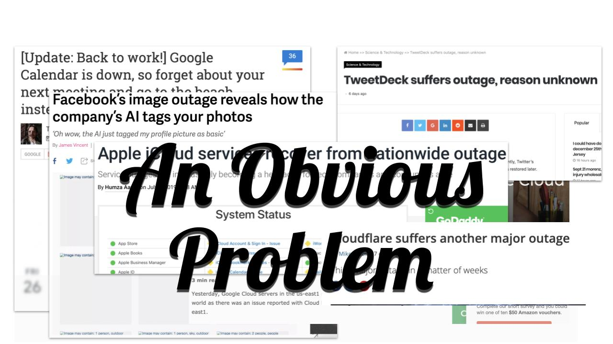
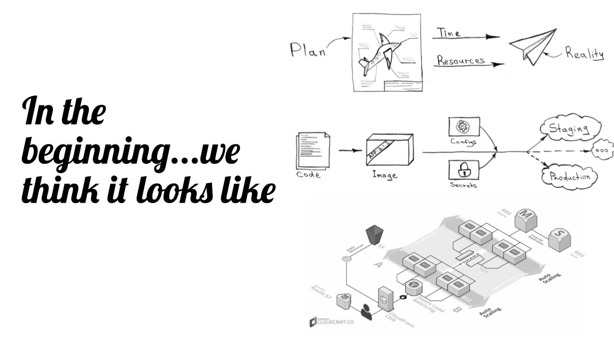
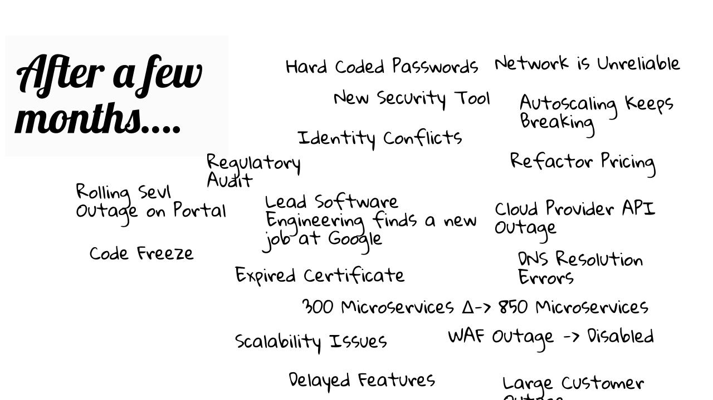
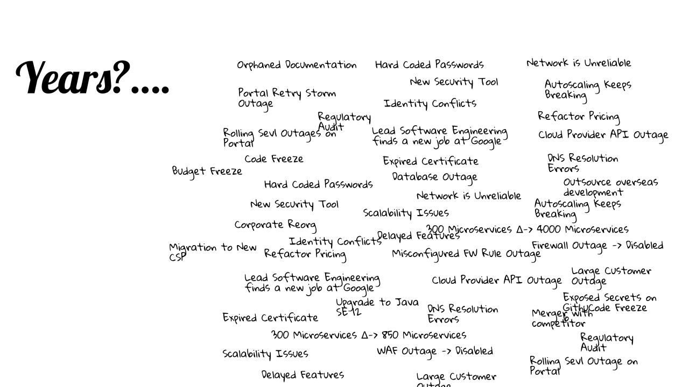
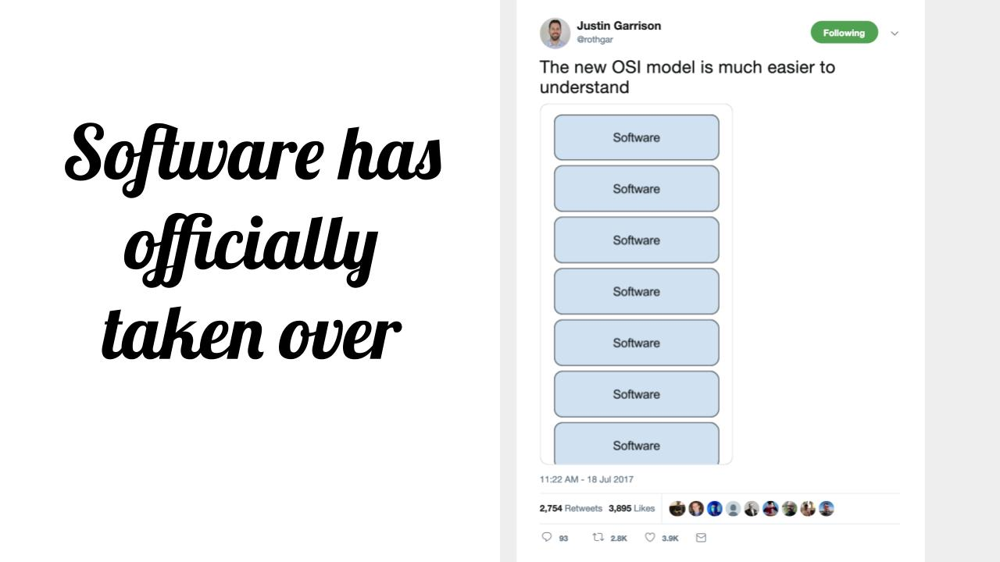

footer: © Verica
slidenumbers: true

.png)

---
# Security **Differently**

---
# __$__whoami

---

---
# __Why__ security differently?

---
^ The Problem is Obvious

---
## __Why__ do outages and breaches seem to be __happening more often__?

---

# __Flawed__ Understanding

### Our understanding of our systems has become fundamentally flawed

---
## System Engineering is a 
# __Messy__ _Affair_

---

---

---

---

---
# Complex Adaptive Systems are Problematic

insert image

---

# Complex Systems Traits
[.text: alignment(left)]
• Cascading Failures 
• Difficult to determine boundaries 
• Complex systems may be open 
• Complex systems may have a memory 
• Complex systems may be nested 
• Dynamic network of multiplicity 
• May produce emergent phenomena 
• Relationships are non-linear 
• Relationships contain feedback loops

---
# Examples of Complex Systems
• Global Financial Markets
• Nation-State PoliicS
• Weather Patterns
• The Human Body
• Bird Patterns
• Distributed Computing Systems (aka your systems)

---
## __Fact:__ Outages & Breaches will continue to get worse 

----
# Unless we begin thinking differently

---
# Software has taken over everything

---

---

# Time to __Rethink/Think__ a Few Things Through

---
## __RETHINK__
# Architecture vs. Archineering

---

> "Scaffolding is never intended to be permanent"

-- Dave Snowden

^You cannot model a complex systems behaviour, the only way to understand it is by interacting with it

---
## __RETHINK__
# Architecture Patterns

---
## __RETHINK__
## Did architecture patterns ever really work? Sometimes/Always/Never?

---
## __RETHINK__
# Threat intel 

---

### All the intel feeds in the world won't mean much if you don’t have your house in order 

---
## __RETHINK__
## Deception = Deception + Work = Misconception

---
## __RETHINK__
## AI/ML/DL/RL & Quantum Entanglement will not magically solve your problems

---
# AI does not yet exist, just stop

---
## __RETHINK__
# Security Policies 

---

### If the security policies aren’t understood or cant be explained effectively by security how are engineers expected to translate them into real-life product?

---
## __RETHINK__
# Risk Management

---

## Measurement and Management of Risk is fundamentally in need of changing 

---

### Software has disrupted our traditional and subjective methods of identifying, measuring and managing system risks.

---
# Navigating Risk vs. Managing Risk

- Does successful companies take more risks or less?
- The ability to identify a problem requires having had experience with it
- Resilient systems typically have more exposure to operational risk and complexity.

---

^# Problem Detection vs. Problem Identification

^Cues-Symptoms-Sensors

---

# __New__ Ways of Thinking

---

# Devops & DevSecOps 
## is now the __new norm__ 

---

# Security LOVES __Chaos Engineering__ 

---

## Postmortems = __Preparation__
^are now the best way to prepare before there is an incident 

---

## Focus on what you have the ability to control 

---

## Resilience doesn’t mean what you think it means 

---
# Resilience != BR/DCP

---

> Resilience is the ability of systems to prevent or adapt to changing conditions in order to maintain control over a system property…to ensure safety… and to avoid failure. 

-- Hollnagel, Woods, & Leveson

---

# Safety and Security have a lot in common 

---

# Failure is the Normal Condition

---

## Humans aren’t the problem, they are the solution 

---

# Root Causes Dont Exist

---

# Automation isn’t a magic answer

---

# Focus on what matters most.

---

# Value Chain

### As a security professional can you clearly articulate where you sit in your company’s value chain?

---
## Does the company exist to deliver product and services or employee desktops?

---

# **Everyone** must code

# Going forward everyone must understand how to write software is a **must**

* Python is a good start, it was originally designed for children

---

> Everyone is responsible for the engineering not just the security.

--Me

---
## Field Guide to 'Human-Error' Investigations by Sydney Dekker

---
## Old View

[.text: alignment(left)]
- Human Error is a cause of trouble
- You need to find people’s mistakes, bad judgements and inaccurate assessments
- Complex Systems are basically safe
- Unreliable, erratic humans undermine systems safety
- Make systems safer by restricting the human condition
---
# New View

[.text: alignment(left)]
- Human error is a symptom of deeper system trouble
- Instead, understand how their assessment and actions made sense at the time - context matters
- Complex systems are basically unsafe
- Complex systems are tradeoffs between competing goals safety vs. efficiency
- People must create safety through practice at all levels
---
# 

---
# 

---

## Software Security Logging 

### _This is a difficult problem and still unsolved in 2019_

---
## Software Dependency Security

---

## We are unknowingly polluting the software we deliver to our customers

---
## Software Secrets in Public Code Repositories

---

### Yes this is still happenning daily
