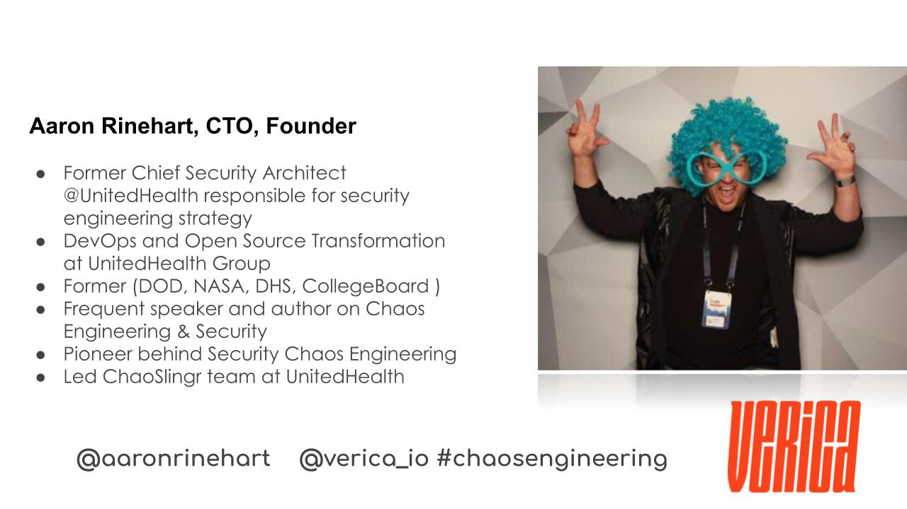
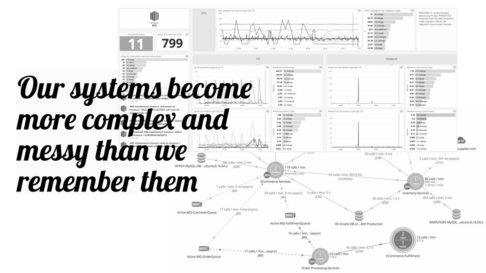

footer:   
slidenumbers: false

.png)

[.hide-footer]

---
# Security **Differently**

---
# __$__whoami

---

[.hide-footer]

---

---
# __Why__ security differently?

^Security Differently comes from Sydney Dekkers Safety Differently Lecture where it states that 
^"Safety differently’ is about relying on people’s expertise, insights and the dignity of work as actually done to improve safety and efficiency. It is about halting or pushing back on the ever-expanding bureaucratization and compliance of work."

---

## __Safety__ and __Security__ have a lot in common 

---
## Safety Differently Origins

[.text: alignment(left)]
> __"Safety differently__' is about relying on people’s expertise, insights and the dignity of work as actually done to improve safety and efficiency. It is about halting or pushing back on the ever-expanding bureaucratization and compliance of work."

-- Sydney Dekker

---
> ## "__Security differently__’ is about relying on people’s expertise, insights and the dignity of work as actually done to improve security and efficiency. It is about halting or pushing back on the ever-expanding bureaucratization and compliance of work." 

---

## Security __Currently__ vs. Security __Differently__

| Security Currently | __Security Differently__ |
| --- | --- |
| People are the Source of Problems| __People are the Solution__ |
| Tell them what to do| __Ask them what they need__ |
| (Control & Compliance)  | __Competency & Common Sense__ |
| Count absence of Negative events  | __Count Presence of Positives__|

---

### __Fact__: No system is secure on its own, it requires humans to create it

---

# Security __Currently__

[.text: alignment(left)]

- Are we doing the things that really matter?
- What is the best measurement of performance?
- How much are we learning from our past performance?
- How do we know when we’re doing well?

^Is how we are doing security today effective at solving the problems?
^Is what we’re doing counting?
^Are we counting what counts?
 ^Are we simply just counting what we can count?
^Or are we counting only that which we are being held accountable for via regulations, compliance, policy, etc.?

---

### Outcomes are the ultimate measurement of effectiveness

---
^ The Problem is Obvious

---
## __Why__ do outages and breaches seem to be __happening more often__?

---

# __Flawed__ Understanding

### Our understanding of our systems has become fundamentally flawed

---
## System Engineering is a 
# __Messy__ _Affair_

---

---

---

---

---
## Complex Systems are __Challenging__

---

# Complex Systems __Traits__

[.text: alignment(left)]
• Cascading Failures
• Difficult to determine boundaries
• Difficult to Model Behavior
• Dynamic network of multiplicity 
• May produce emergent phenomena
• Relationships are non-linear 
• Relationships contain feedback loops

---
[.text: alignment(left)]
# __Examples__ of Complex Systems
• Global Financial Markets
• Nation-State PoliicS
• Weather Patterns
• The Human Body
• Bird Patterns
• Distributed Computing Systems (__aka your systems__)

---
## __Fact:__ Outages & Breaches will continue to get worse 

----
## Unless we begin thinking differently

---
## Software has taken over everything

---

---

## Areas of potential improvement

---

## Architecture vs. Archineering
^Explain the thing first...Establish what we think '' actually is before i explain what its not
^make the architecture slide look like an architecture diagram

^Issues with Architecture Practices in today's software and internet driven world. How is architecture still important? Has it lost its relevance or importance or do we just need to rethink our processes, tools and methods to align.

---

> "Scaffolding is never intended to be permanent"

-- Dave Snowden

^You cannot model a complex systems behaviour, the only way to understand it is by interacting with it

---

# Architecture Patterns

^Architecture Patterns have always been an 

^## Did architecture patterns ever really work? Sometimes/Always/Never?

---

# Threat intel 
^Establish what we think "Threat Intel is "

---

### All the intel feeds in the world won't mean much if you don’t have your house in order 

---

## Deception Techniques = More Attack Surface Management

---

## AI/ML/DL/RL & Quantum Entanglement will not magically solve your problems

---
## AI does not yet exist, just stop

---

# Security Policies 

---

### If the security policies aren’t understood or cant be explained effectively by security how are engineers expected to translate them into real-life product?

^Netflix does not have actualy security policy. They codify what 

---
# Risk Management

---

## Measurement and Management of Risk is fundamentally in need of changing 

---

### Software has disrupted our traditional and subjective methods of identifying, measuring and managing system risks.

---
# Navigating Risk vs. Managing Risk

- Does successful companies take more risks or less?
- The ability to identify a problem requires having had experience with it
- Resilient systems typically have more exposure to operational risk and complexity.

---

^# Problem Detection vs. Problem Identification

^Cues-Symptoms-Sensors

---

# __New__ Ways of Thinking

---

# Devops & DevSecOps 
## is now the __new norm__ 

---

# Security LOVES __Chaos Engineering__ 

---

## Postmortems = __Preparation__
^are now the best way to prepare before there is an incident 

---

## Focus on what you have the ability to control 

---

## Resilience doesn’t mean what you think it means 

---
# __Resilience__ != DR/BCP

---

> Resilience is the ability of systems to prevent or adapt to changing conditions in order to maintain control over a system property…to ensure safety… and to avoid failure. 

-- Hollnagel, Woods, & Leveson

---

# __Failure is__ the __Normal__ Condition

---

## __Humans aren’t the problem__, they are the __solution__

---

# __Root Causes__ Dont Exist

---
## Field Guide to 'Human-Error' Investigations by Sydney Dekker

---
## Old View

[.text: alignment(left)]
- Human Error is a cause of trouble
- You need to find people’s mistakes, bad judgements and inaccurate assessments
- Complex Systems are basically safe
- Unreliable, erratic humans undermine systems safety
- Make systems safer by restricting the human condition

---
# New View

[.text: alignment(left)]
- Human error is a symptom of deeper system trouble
- Instead, understand how their assessment and actions made sense at the time - context matters
- Complex systems are basically unsafe
- Complex systems are tradeoffs between competing goals safety vs. efficiency
- People must create safety through practice at all levels

---

# __Automation__ isn’t a magic answer

---

# __Focus__ on what matters most.

---

# __Value Chain__

### As a security professional can you clearly articulate where you sit in your company’s value chain?

---
## Does the company exist to deliver product and services or employee desktops?

---

# **Everyone** must code

---

### Going forward everyone must understand how to write software is a **must**

---

#### Python is a good start, it was originally designed for children

---

> Everyone is responsible for the engineering not just the security.

---

# Summary & Take Aways

---

# Apply what you learned

---

---
# Thank You Austin!

---

## Software Security Logging 

### _This is a difficult problem and still unsolved in 2019_

---
## Software Dependency Security

---

## We are unknowingly polluting the software we deliver to our customers

---
## Software Secrets in Public Code Repositories

---

### Yes this is still happenning daily
